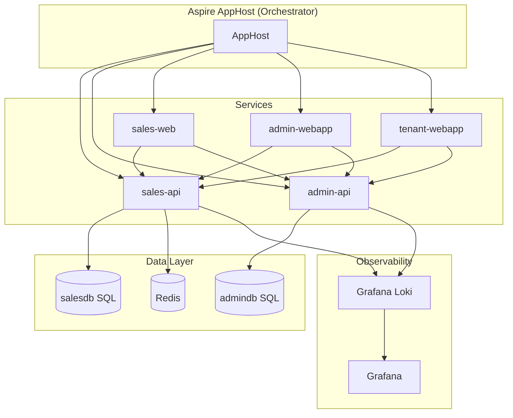
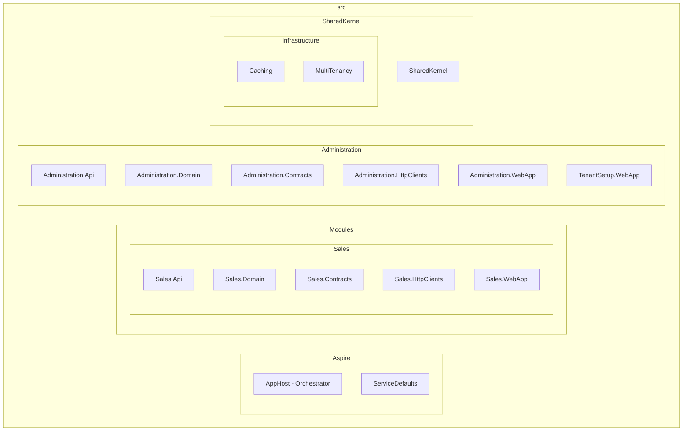
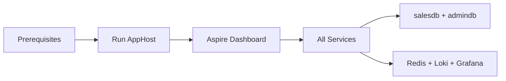

# SilkRoadErp

SilkRoadErp is a multi-tenant ERP solution built with .NET Aspire. It provides modules for sales operations, supplier management, administration, and tenant provisioning. The application uses a distributed microservices architecture with Blazor Server web apps consuming backend APIs.

## Architecture

The solution is orchestrated by **Aspire AppHost** and runs the following services:



### Services

| Service | Description |
|--------|-------------|
| **Sales API** | REST API for sales, clients, suppliers, invoices, delivery notes, products, orders, quotations |
| **Administration API** | Tenant and administration management |
| **Sales WebApp** | Blazor Server UI for sales operations |
| **Administration WebApp** | Blazor Server UI for administration |
| **TenantSetup WebApp** | Blazor Server UI for initial tenant configuration |

### Infrastructure

- **SQL Server** – Two databases: `salesdb` (sales module), `admindb` (administration)
- **Redis** – Distributed caching for the Sales API
- **Grafana Loki** – Log aggregation
- **Grafana** – Dashboards and monitoring (port 3000)

## Project Structure



| Path | Description |
|------|-------------|
| `Aspire/AppHost` | Orchestrator — run this to start all services |
| `Aspire/ServiceDefaults` | Shared service configuration |
| `Modules/Sales/*` | Sales REST API, domain, contracts, HTTP clients, Blazor UI |
| `Administration/*` | Administration and tenant APIs and web apps |
| `SharedKernel/` | Shared kernel, caching, and multi-tenancy infrastructure |

### Sales Module

The Sales module handles both customer-facing sales and supplier-side operations:

- **Sales**: Clients, invoices (Factures), credit notes (Avoirs), delivery notes (Bons de livraison), orders, quotations, payments
- **Purchasing**: Suppliers (Fournisseurs), supplier invoices (Factures fournisseurs), supplier credit notes, expense invoices (Factures dépenses), reception notes, returns
- **Catalog**: Products (Produits), categories, subcategories, tags, inventory

It uses **multi-tenancy** (per-tenant data isolation) and **accounting year** scoping for financial documents.

## Technology Stack

| Layer | Technology |
|-------|------------|
| Backend | .NET 8+, Carter (minimal APIs), MediatR (CQRS) |
| Frontend | Blazor Server, Blazor.Bootstrap, Radzen |
| Database | SQL Server, Entity Framework Core 10 |
| Caching | Redis |
| Auth | JWT Bearer |
| Logging | Serilog, Grafana Loki |
| Orchestration | Aspire AppHost |

## Getting Started



### Prerequisites

- .NET 8 SDK
- Docker (for SQL Server, Redis, Loki, Grafana when running via Aspire)

### Run the application

From the repository root:

```sh
cd src/Aspire/TunNetCom.SilkRoadErp.AppHost
dotnet run
```

This starts the Aspire dashboard and all services. The dashboard shows endpoints for each application.

### Run without Aspire

To run individual projects (e.g. Sales API or Sales WebApp), configure connection strings in `appsettings.json` or user secrets, then:

```sh
# Sales API
cd src/Modules/Sales/TunNetCom.SilkRoadErp.Sales.Api
dotnet run

# Sales WebApp
cd src/Modules/Sales/TunNetCom.SilkRoadErp.Sales.WebApp
dotnet run
```

### Database migrations

From the Sales Domain project:

```sh
cd src/Modules/Sales/TunNetCom.SilkRoadErp.Sales.Api
dotnet ef database update --project ../TunNetCom.SilkRoadErp.Sales.Domain
```

## Contributing

1. Fork the repository.
2. Create a feature branch.
3. Commit your changes and open a pull request.

## License

This project is licensed under the MIT License.

## Contact

