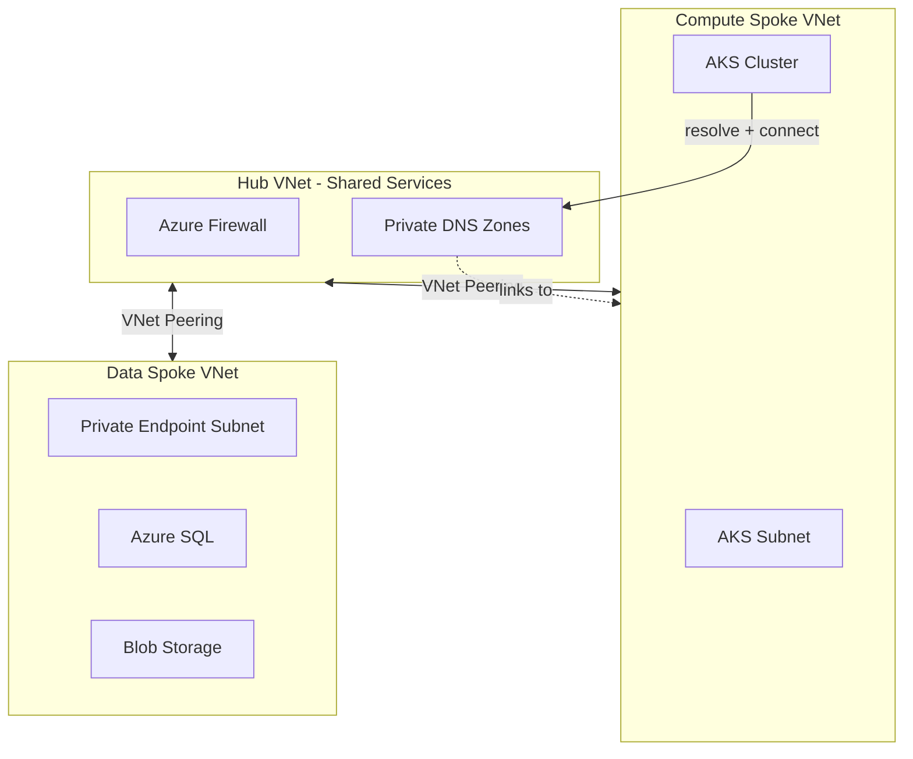

# AKS Hub-Spoke Architecture for SilkRoad ERP

Architecture and best practices for provisioning AKS in a Hub-and-Spoke topology with Compute and Data spokes, using Bicep or Terraform.

---

## Target Architecture



**Design principles:**

- **Hub**: Firewall, Private DNS Zones (no Bastion for AKS-only)
- **Compute spoke**: AKS only (no VMs)
- **Data spoke**: Azure SQL + Storage with Private Endpoints
- **Traffic**: AKS → Hub → Data spoke via private endpoints; DNS via Private DNS Zones linked to Compute spoke

---

## 1. Networking Best Practices

| Practice | Recommendation |
|----------|----------------|
| **Address space** | Non-overlapping CIDRs: Hub `10.0.0.0/16`, Compute `10.1.0.0/16`, Data `10.2.0.0/16`. Reserve room for growth. |
| **Subnet sizing** | AKS subnets: minimum `/22` for future scaling. Private endpoint subnet: `/26` or `/27`. |
| **Traffic path** | All egress via Hub Firewall; UDRs on spoke subnets route `0.0.0.0/0` to Firewall. |
| **No transitive peering** | Do not peer Compute ↔ Data; traffic must go Hub → Compute or Hub → Data. |
| **NSGs** | Minimal NSGs on AKS subnets; avoid blocking AKS control plane. Prefer Firewall rules over NSGs. |

---

## 2. Identity & Access

| Practice | Recommendation |
|----------|----------------|
| **Managed identity for AKS** | Use system-assigned managed identity for the cluster; avoid service principal keys. |
| **Workload identity** | Use Azure AD Workload Identity for pods to obtain credentials without storing secrets. |
| **RBAC** | Enable Azure RBAC on AKS; integrate with Azure AD. Map groups to `cluster-admin`, `edit`, `view`. |
| **SQL auth** | Prefer Azure AD auth for SQL; otherwise use Key Vault + CSI driver. |
| **Least privilege** | Grant SQL/Storage access only to the AKS managed identity or workload identity. |

---

## 3. Secrets Management

| Practice | Recommendation |
|----------|----------------|
| **Key Vault** | Dedicated Key Vault (Hub or dedicated RG) for SQL connection strings, API keys, certificates. |
| **AKS → Key Vault** | Azure Key Vault Provider for Secrets Store CSI Driver (or External Secrets Operator). |
| **No secrets in manifests** | Never embed connection strings in YAML; reference from Key Vault or K8s secrets injected by CI/CD. |
| **Rotation** | Plan for credential rotation; Key Vault sync reduces manual pod restarts. |

---

## 4. AKS Cluster Configuration

| Practice | Recommendation |
|----------|----------------|
| **Node pools** | Separate system pool (2–3 nodes, `Standard_D2s_v3`) and user pool for workloads. Enable autoscale on user pool. |
| **Upgrade channel** | Use `stable` for production. |
| **Version** | Keep node pools within 2 minor versions of control plane. |
| **Azure CNI** | Use Azure CNI for VNet integration and private endpoint connectivity. |
| **Private cluster** | Consider private AKS API for production; use authorized IP ranges or VPN for kubectl. |
| **Node OS** | Azure Linux (Mariner) or Ubuntu. |

---

## 5. Data Layer

| Practice | Recommendation |
|----------|----------------|
| **SQL** | Azure SQL Flexible Server with private endpoints; disable public access. Zone redundancy for high SLA. |
| **Storage** | Block public access; allow only selected VNets or private endpoints. |
| **Backups** | SQL automated backups with retention; Blob lifecycle policies. |
| **Encryption** | Default encryption (TLS, at-rest) for SQL and Storage. |
| **Private endpoints** | Dedicated subnet `10.2.2.0/26` for all private endpoints. |

---

## 6. DNS & Private Endpoints

| Practice | Recommendation |
|----------|----------------|
| **Private DNS Zones** | Create `privatelink.database.windows.net`, `privatelink.blob.core.windows.net`. |
| **VNet links** | Link zones to Compute spoke VNet (where AKS runs) so pods resolve to private IPs. |
| **Resolution order** | Use `private_dns_zone_group` on private endpoints for automatic registration. |
| **Centralized DNS** | Optional: Azure DNS Private Resolver in Hub for custom resolution. |
| **Consistency** | Avoid split-brain (public and private resolution for same FQDN). |

---

## 7. Observability & Operations

| Practice | Recommendation |
|----------|----------------|
| **Logs** | Enable AKS diagnostic logs (audit, kube-apiserver, cluster-autoscaler) to Log Analytics. |
| **Metrics** | Enable Container Insights; integrate Azure Monitor with Prometheus as needed. |
| **Alerts** | Node health, pod failures, CPU/memory, SQL DTU limits, storage latency. |
| **App logs** | Structured logging (e.g. Serilog); ship to Log Analytics. |
| **Tracing** | Application Insights or OpenTelemetry for distributed tracing. |

---

## 9. Cost & Efficiency

| Practice | Recommendation |
|----------|----------------|
| **Naming** | `{env}-{app}-{resource}-{region}` (e.g. `prod-silkroad-aks-weu`). |
| **Tags** | Enforce `Environment`, `Project`, `CostCenter`, `Owner`. |
| **Reserved capacity** | Consider reserved instances for stable system pool and SQL. |
| **Right-sizing** | Start small; use autoscale and monitoring to tune. |
| **Cleanup** | Define lifecycle for dev/test resources; automate deletion. |

---

## File Structure

```
deployments/
├── infrastructure/
│   ├── ARCHITECTURE.md           # This document
│   ├── bicep/
│   │   ├── main.bicep
│   │   ├── parameters.bicep
│   │   ├── main.parameters.json
│   │   ├── modules/
│   │   │   ├── hub-network.bicep
│   │   │   ├── spoke-compute.bicep
│   │   │   ├── spoke-data.bicep
│   │   │   ├── peering.bicep
│   │   │   ├── private-dns.bicep
│   │   │   ├── key-vault.bicep
│   │   │   └── aks-cluster.bicep
│   │   └── README.md
│   └── terraform/
│       ├── main.tf
│       ├── variables.tf
│       ├── outputs.tf
│       ├── versions.tf
│       ├── hub.tf
│       ├── spoke-compute.tf
│       ├── spoke-data.tf
│       ├── peering.tf
│       ├── private-dns.tf
│       ├── key-vault.tf
│       ├── terraform.tfvars.example
│       └── README.md
```

---

## Deployment Order

1. Hub (VNet, Firewall subnets, Private DNS Zones)
2. Key Vault
3. Data spoke (VNet, SQL, Storage, private endpoints, DNS links)
4. Compute spoke (VNet, AKS subnets)
5. Peering (Hub ↔ Compute, Hub ↔ Data)
6. AKS cluster

---

## References

- [Azure Hub-Spoke topology](https://learn.microsoft.com/en-us/azure/architecture/reference-architectures/hybrid-networking/hub-spoke)
- [AKS best practices](https://learn.microsoft.com/en-us/azure/aks/best-practices)
- [Private endpoints and DNS](https://learn.microsoft.com/en-us/azure/private-link/private-endpoint-dns)
